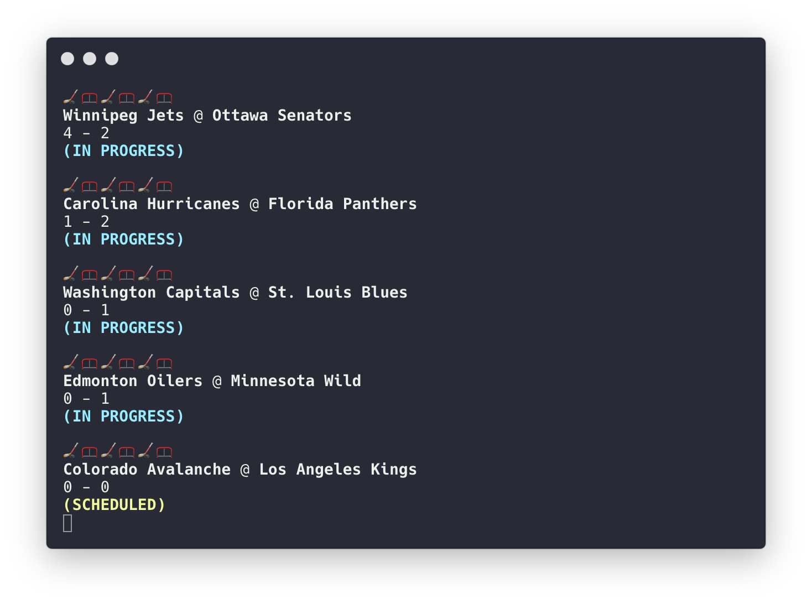

a scraper that displays the scores of the day's NHL games. updates every 30 seconds from the NHL json scoreboard API



## getting started

**requirements**

* python v3.6 - recommended

> python v2 works fine, just remove the `3` from the header of the file and cmds

**installation**

`pip3 install -r requirements.txt`

after installing requirements, permit the script to execute:

`chmod u+x gwg.py`

## usage

```bash
gwg.py
```

## License

This repo was originally forked from [Ticker](https://github.com/stvhwrd/Ticker) then tweaked to integrate the new NHL api.

[MIT License](./LICENSE)
