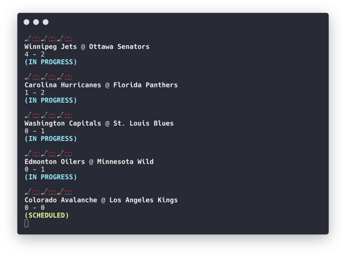

# gwg

a scraper that displays the scores of the day's NHL games. updates every 30 seconds from the NHL json scoreboard API



## getting started

**requirements**

* python v3.6 - recommended

> python v2 works fine, just remove the `3` from the header of the file and cmds

**installation**

`pip3 install -r requirements.txt`

## usage

```bash
python3 gwg.py
```